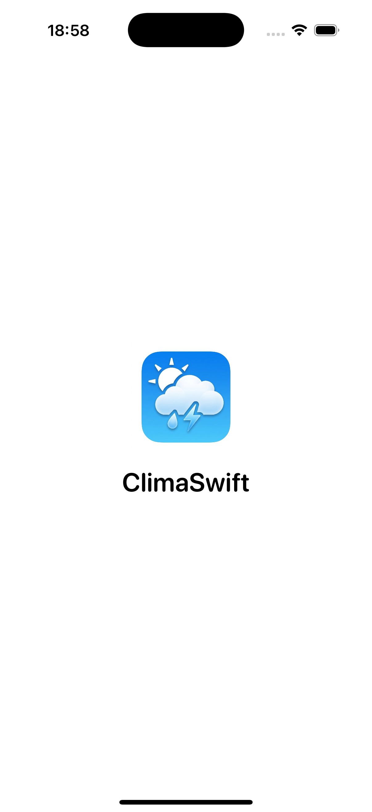
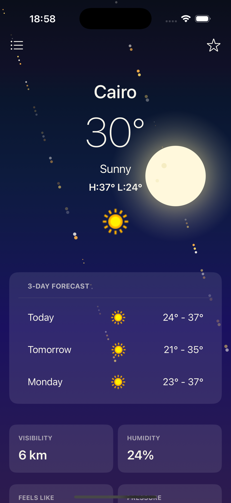
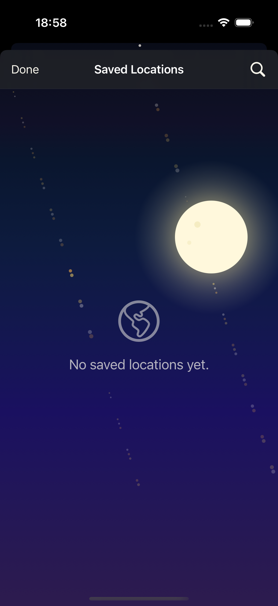
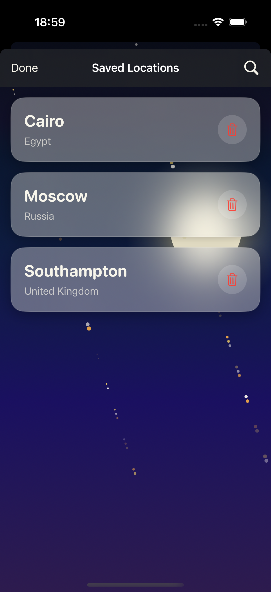
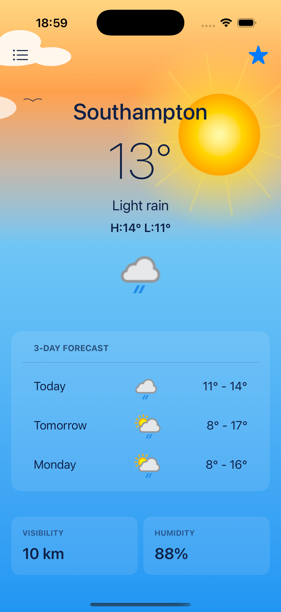
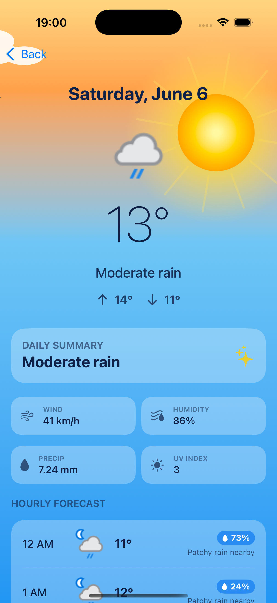
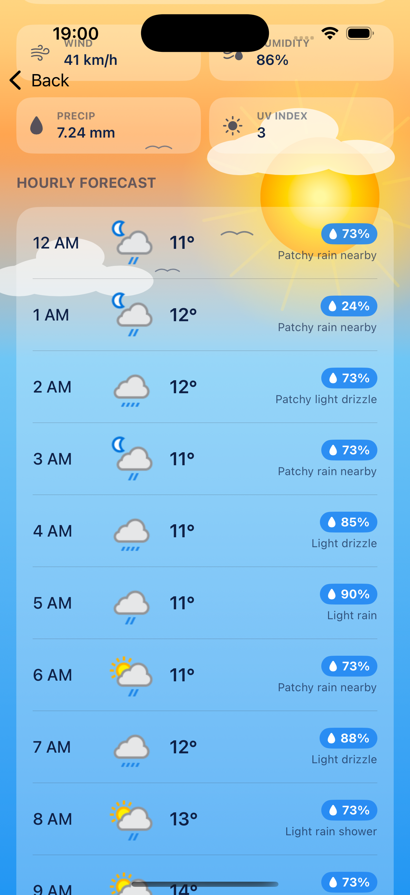
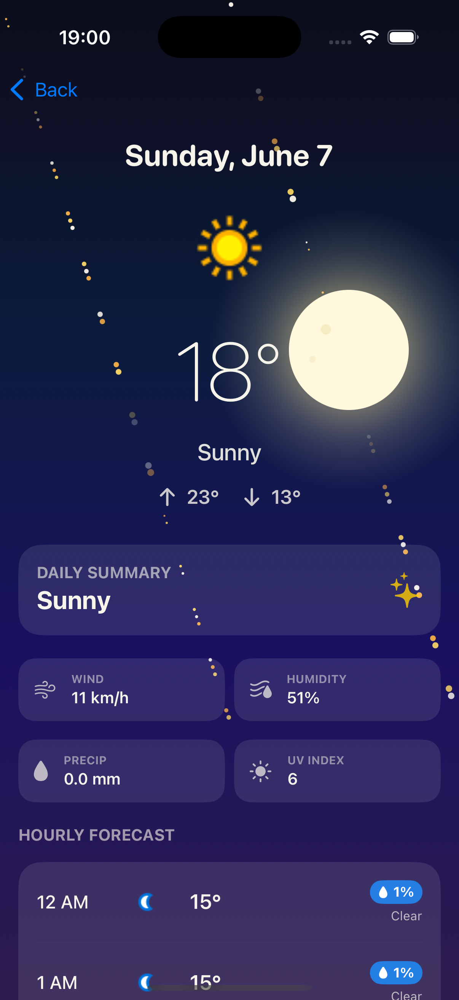
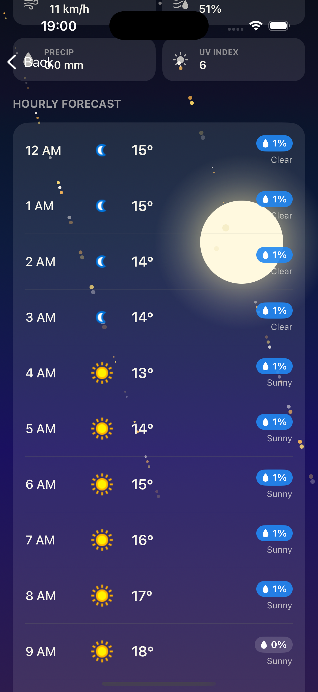
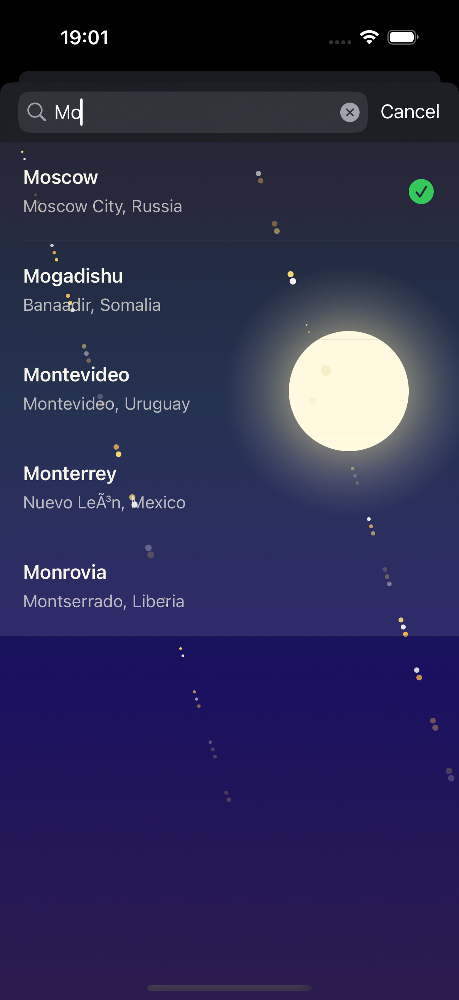

# ClimaSwift 🌤️

A beautifully crafted iOS weather app built with **SwiftUI**, featuring dynamic theming, multi-city support, hourly forecasts, and a clean Clean Architecture foundation.

---

## 📱 Screenshots

<p align="center">
  
  
  
  
  
</p>

<p align="center">
  
  
  
  
  
</p>

---

## ✨ Features

- 🌡️ **Real-time Weather** — Current temperature, condition, humidity, visibility, pressure & feels-like
- 📅 **3-Day Forecast** — Daily high/low with weather icons
- 🕐 **Hourly Forecast** — Hour-by-hour breakdown for each day
- 🌆 **Dynamic Theming** — Background and colors adapt automatically to the local time of day (morning, day, evening, night)
- 📍 **Multi-City Support** — Save and swipe between multiple cities
- 🔍 **Location Search** — Search any city worldwide via WeatherAPI
- ⭐ **Saved Locations** — Persist favorite cities using SwiftData
- 💫 **Animated Backgrounds** — Smooth gradient animations tied to weather and time
- 🌙 **Splash Screen** — Elegant animated launch screen

---

## 🏗️ Architecture

ClimaSwift is built on **Clean Architecture** with a clear separation of concerns:

```
ClimaSwift/
├── Core/
│   ├── Networking/        # NetworkClient (Alamofire), API endpoints
│   ├── Theme/             # DynamicThemeEngine, ThemeType
│   └── DI/                # Swinject DependencyContainer
│
└── Features/
    ├── Dashboard/
    │   ├── Data/          # RemoteWeatherDataSource, WeatherRepositoryImpl
    │   ├── Domain/        # WeatherDomainModel, UseCases, Repository interfaces
    │   └── Presentation/  # DashboardView, DashboardViewModel
    │
    ├── HourlyForecast/
    │   ├── Data/          # RemoteHourlyForecastDataSource
    │   ├── Domain/        # HourlyForecastDomainModel, UseCases
    │   └── Presentation/  # HourlyForecastView, HourlyForecastViewModel
    │
    ├── LocationSearch/
    │   ├── Data/          # RemoteSearchDataSource, LocalLocationDataSource (SwiftData)
    │   ├── Domain/        # LocationDomainModel, UseCases
    │   └── Presentation/  # SearchView, SavedLocationsView, ViewModels
    │
    └── Splash/            # SplashScreenView
```

---

## 🛠️ Tech Stack

| Layer | Technology |
|-------|-----------|
| UI | SwiftUI |
| Local Persistence | SwiftData |
| Networking | Alamofire |
| Image Loading | SDWebImageSwiftUI |
| Dependency Injection | Swinject |
| Weather Data | [WeatherAPI.com](https://www.weatherapi.com/) |
| Minimum iOS | iOS 17+ |

---

## 🚀 Getting Started

### Prerequisites

- Xcode 15+
- iOS 17+
- A free API key from [WeatherAPI.com](https://www.weatherapi.com/)

### Installation

1. **Clone the repository**
   ```bash
   git clone https://github.com/ahmedelkady757/ClimaSwift.git
   cd ClimaSwift
   ```

2. **Open the project**
   ```bash
   open ClimaSwift.xcodeproj
   ```

3. **Configure your API Key**

   Open `Core/DI/DependencyContainer.swift` and replace the API key:
   ```swift
   let apiKey = "YOUR_API_KEY_HERE"
   ```

4. **Build & Run** on the simulator or a physical device (iOS 17+)

---

## 📂 Project Structure

```
ClimaSwift/
├── ClimaSwiftApp.swift       # App entry point, SwiftData container setup
├── Core/
│   ├── DI/
│   │   └── DependencyContainer.swift
│   ├── Networking/
│   │   ├── NetworkClient.swift
│   │   └── AppError.swift
│   └── Theme/
│       └── DynamicThemeEngine.swift
├── Features/
│   ├── Dashboard/
│   ├── HourlyForecast/
│   ├── LocationSearch/
│   └── Splash/
└── Assets.xcassets
```

---

## 🎨 Dynamic Theming

ClimaSwift automatically adapts its color palette based on the **local time** at the selected city:

| Time of Day | Theme |
|------------|-------|
| 🌅 Morning (6am – 10am) | Warm orange & gold tones |
| ☀️ Day (10am – 5pm) | Bright blue & white |
| 🌆 Evening (5pm – 8pm) | Purple & amber gradients |
| 🌙 Night (8pm – 6am) | Deep navy & midnight blue |

---

## 📡 API Reference

This app uses the [WeatherAPI.com](https://www.weatherapi.com/) REST API:

- **Endpoint:** `GET https://api.weatherapi.com/v1/forecast.json`
- **Parameters:** `key`, `q` (lat,lon), `days`, `aqi`, `alerts`

---

## 🤝 Contributing

Contributions are welcome! Please:

1. Fork the repository
2. Create a feature branch (`git checkout -b feature/amazing-feature`)
3. Commit your changes (`git commit -m 'Add amazing feature'`)
4. Push to the branch (`git push origin feature/amazing-feature`)
5. Open a Pull Request

---

## 📄 License

This project is licensed under the MIT License — see the [LICENSE](LICENSE) file for details.

---

## 👨‍💻 Author

**Ahmed Elkady**  
[](https://github.com/ahmedelkady757)

---

<p align="center">Made with ❤️ and SwiftUI</p>
